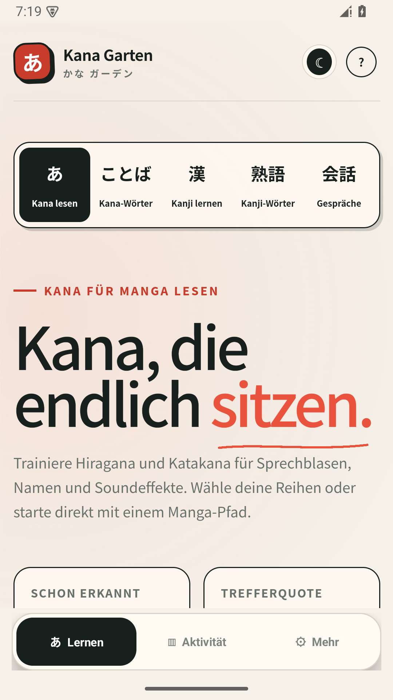
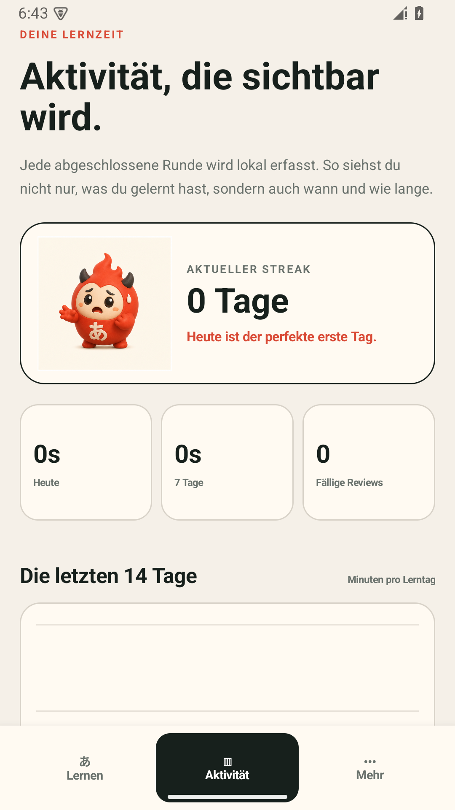
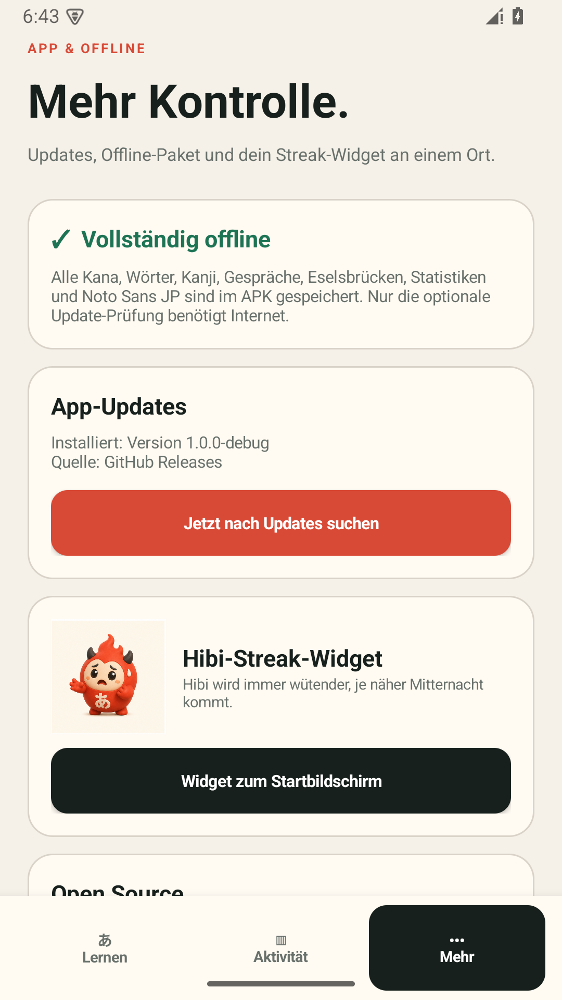

# Kana Garten für Android

Eine vollständige, offlinefähige Android-App zum Lesen, Verstehen und Sprechen von Japanisch. Sie enthält die gesamte Lernlogik von [japanese.fasrv.ch](https://japanese.fasrv.ch/) und ergänzt sie um ein natives Usage-Dashboard, zeitbasiertes Spaced Repetition, GitHub-Auto-Updates und das Hibi-Streak-Widget.

[Neueste APK herunterladen](https://github.com/Nikoheld/kana-garten-android/releases/latest)

## App

| Lernen | Aktivitäts-Dashboard | Offline & Updates |
| --- | --- | --- |
|  |  |  |

## Funktionen

- Hiragana und Katakana, frei kombinierbare Reihen und Eselsbrücken; optional werden Zielzeichen in kurzen Sätzen markiert und nach der Antwort mit vollständiger Lesung und deutscher Übersetzung erklärt
- Kana- und Kanji-Satzkarten bleiben nach jeder Antwort vollständig sichtbar und wechseln erst nach bewusstem Tippen auf „Weiter“
- 65 kombinierbare Alltagsszenarien mit 750+ Kana-Wörtern, Einzelwortauswahl und globalem Spaced-Repetition-Topf
- frei einstellbare Wortfestigung von 1 bis 20 sicheren Treffern, direkt in den App-Einstellungen sowie bei Kana- und Kanji-Wörtern; fehlerfreie Serien vergrößern die Abstände besonders schnell, wiederholte Fehler holen ein Wort bis auf wenige Minuten zurück
- einzelne Kanji und Kanji-Wörter von N5 bis N1; einzelne Kanji lassen sich optional im natürlichen Satzkontext lernen
- 170 zentrale Grammatikthemen von N5 bis N1 mit Themen- und Einzelauswahl, Regel, Bildung, Lesung, deutscher Übersetzung, Stolperfallen und aktiven Lückensatz-Aufgaben
- 50 Gesprächssituationen in sieben Themenbereichen mit Rollenspiel, geführtem Sprechen und Shadowing
- lokaler Aufnahmevergleich, natürliche Alternativantworten, Sinnabschnitt-Training, Mora-Rhythmus und ehrliche dreistufige Selbsteinschätzung
- globaler Sprech-Wiederholungstopf unabhängig von der aktuellen Themen- und Levelauswahl
- ein gemeinsamer Spaced-Repetition-Plan für Kana, Wörter, Kanji, Kanji-Wörter, Grammatik und Gespräche; Kana starten nach 10 Minuten, später wachsen die Abstände bis auf 120 Tage
- native Lern-Erinnerungen zum nächsten fälligen Termin, auch bei geschlossener App und nach einem Geräteneustart
- vollständig offline gebündelte Inhalte, Datensätze und Noto Sans JP
- garantiertes, direkt im APK mitgeliefertes Offline-Audio für alle 208 Hiragana- und Katakana-Karten sowie sämtliche normalen Kana-Wort-, Kanji- und Kanji-Wort-Lernkarten; dafür wird keine Android-Systemstimme und kein Internet benötigt
- für vollständige Sätze und Gespräche bevorzugt Android eine japanische Offline-Stimme, akzeptiert aber jede funktionierende japanische Systemstimme und führt bei fehlenden Sprachdaten direkt zur Installation
- optional einblendbare Kana-Lesehilfen für einzelne Kanji, Satzkontext und Kanji-Wörter; die Auswahl wird dauerhaft gespeichert
- doppelte Fortschrittssicherung: Web-Speicher plus natives Android-Backup
- lokales Usage-Dashboard mit Lernzeit pro Tag, Bereich, Woche, Streak, fälligen Reviews und letzten Einheiten
- frei einstellbares tägliches Lernzeitziel von 5 Minuten bis 24 Stunden, wählbare Erinnerungszeit und optionale Zielkarte auf dem Lern- und Aktivitäts-Dashboard; zusätzliche Lernzeit bleibt unbegrenzt
- optionale JLPT-Fortschrittsleiste von N5 bis N1, ausgewogen aus sicher gelernten Kana-Wörtern, Kanji-Wörtern, Kanji und Gesprächen berechnet
- responsives Hibi-Widget in vier Größenklassen: schnelle 2×1-Streak-Kachel, Figurenkarte, breite Lernkarte und Detailkarte mit Tagesziel sowie fälligen Wiederholungen; Hibis vier Emotionen steigern sich bis zum drohenden Streak-Verlust
- Auto-Updater über signierte APKs aus GitHub Releases
- App-weiter Hell-/Dunkelmodus inklusive Systemleisten, Dashboard, Einstellungen, Dialogen und Widget

## Datenschutz und Offline-Verhalten

Lernfortschritt, Aufnahmen und Nutzungsdaten verlassen das Gerät nicht. Sprachaufnahmen werden nur temporär im WebView gehalten und beim nächsten Gespräch gelöscht. Internet wird ausschliesslich für die freiwillige Update-Prüfung benötigt. Details stehen in [PRIVACY.md](PRIVACY.md).

Alle einzelnen Kana, Kana-Wörter, Kanji-Lesungen und Kanji-Wörter werden aus mitgelieferten MP3-Dateien abgespielt und funktionieren vollständig unabhängig von Android Text-to-Speech. Nur für dynamisch erzeugte Sätze und Gespräche nutzt die App zusätzlich Android Text-to-Speech. Wenn noch keine japanische Stimme installiert ist, führt die App direkt zur Einrichtung; alle übrigen Lernfunktionen bleiben offline verfügbar.

Die Ausspracheaufnahmen wurden mit dem Apache-2.0-lizenzierten Modell [Kokoro-82M](https://huggingface.co/hexgrad/Kokoro-82M) erzeugt. Das Modell selbst ist nicht Bestandteil der App; das reproduzierbare Erzeugungsskript liegt unter `tools/generate_pronunciation_audio.py`.

## Technik

- Java 17, Android SDK 35, Mindestversion Android 8.0
- eigenständiges, touch-orientiertes Mobile-Layout sowie native Android-Views für Dashboard, Navigation, Erinnerungen, Update-Flow und Widget
- sichere lokale HTTPS-Origin `https://app.local` für die gebündelte Lernoberfläche
- SharedPreferences für Usage-Daten und natives Fortschritts-Backup
- Android `DownloadManager` und Paketinstaller für Updates
- `AppWidgetProvider`/`RemoteViews` für das Streak-Widget

## Lokal bauen

```bash
export ANDROID_HOME=/path/to/android-sdk
./gradlew assembleDebug
```

Die Debug-APK liegt danach unter `app/build/outputs/apk/debug/app-debug.apk`.

Ein signierter Release-Build erwartet diese Umgebungsvariablen:

```text
KEYSTORE_PATH
KEYSTORE_PASSWORD
KEY_ALIAS
KEY_PASSWORD
```

Signierschlüssel und Passwörter werden nicht im Repository gespeichert. Offizielle APKs werden mit dem dauerhaft gesicherten Projektschlüssel signiert.

## Releases und Auto-Updater

Offizielle Versionen werden als signierte APK zusammen mit ihrer SHA-256-Prüfsumme unter [GitHub Releases](https://github.com/Nikoheld/kana-garten-android/releases) veröffentlicht. Installierte Apps vergleichen ihre Versionsnummer mit dem neuesten Release und bieten das APK direkt in der App an. Android prüft zusätzlich, dass ein Update mit demselben App-Schlüssel signiert ist.

## Maskottchen

Hibi ist ein eigens für Kana Garten erstellter, KI-generierter Feuergeist. Das Sprite mit allen vier Streak-Stimmungen liegt in [`docs/hibi-mascot-sprite.png`](docs/hibi-mascot-sprite.png). Für das responsive Widget werden zusätzlich freigestellte, für Hell- und Dunkelmodus optimierte Varianten verwendet.

## Lizenz

Quellcode: [MIT](LICENSE). Noto Sans JP wird unter der SIL Open Font License verteilt. Hibi und die zugehörigen Illustrationen sind Projekt-Assets und nicht Teil der MIT-Code-Lizenz.
